# Jarkom-Modul-4-D17-2023

**Praktikum Jaringan Komputer Modul 4 Tahun 2023**

# Author
| Nama | NRP |Github |
|---------------------------|------------|--------|
|Adam Haidar Azizi | 5025211114 | https://github.com/HADAIZI |
|Ahda Filza Ghaffaru | 5025211144 | https://github.com/Ahdaaa |

# **Dokumentasi dan Penjelasan Soal**

Berikut adalah dokumentasi yang berisi source code dari tiap soal dan penjelasan terkait perintah atau _syntax_ yang digunakan. 

## **Soal Praktikum 4**
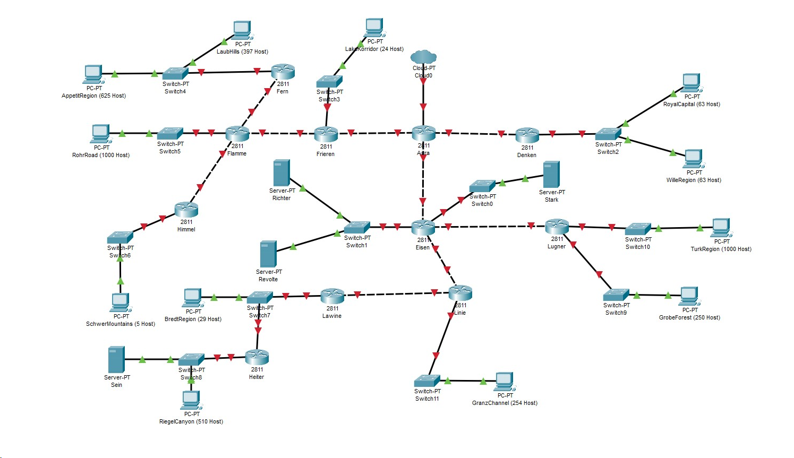

- Soal shift dikerjakan pada Cisco Packet Tracer dan GNS3 menggunakan metode perhitungan CLASSLESS yang berbeda.
Keterangan: Bila di CPT menggunakan VLSM, maka di GNS3 menggunakan CIDR atau sebaliknya

- Jika tidak ada pemberitahuan revisi soal dari asisten, berarti semua soal BERSIFAT BENAR dan DAPAT DIKERJAKAN.

- Untuk di GNS3 CLOUD merupakan NAT1 jangan sampai salah agar bisa terkoneksi internet.

- Pembagian IP menggunakan Prefix IP yang telah ditentukan pada modul pengenalan.

- Pembagian IP dan routing harus SE-EFISIEN MUNGKIN.
Gambar topologi yang lebih jelas dapat diakses pada link [berikut](https://drive.google.com/file/d/1VmJXOyEoWru1tfXISOgoJiPfE1hpbptM/view)

### **Rute**
- Berikut adalah rute subnet dari topologi kami
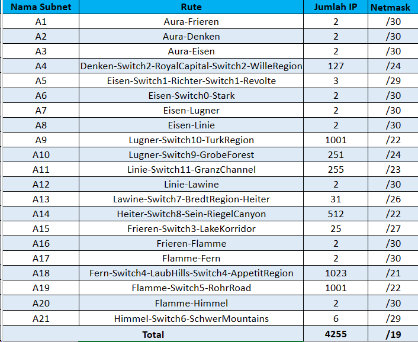
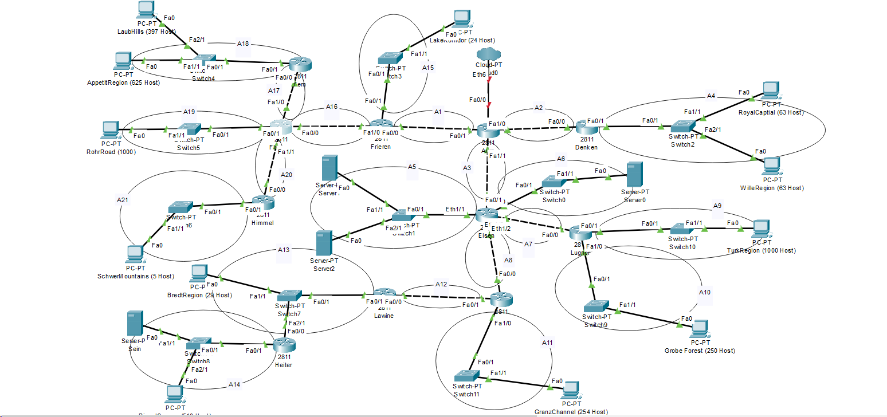

# **VLSM**
Berikut adalah langkah-langkah pengerjaan untuk metode VLSM pada Ciscoo.
## **_Subnetting_**
Subnetting adalah proses membagi suatu jaringan IP menjadi bagian-bagian yang lebih kecil yang disebut subnet. Tujuan utama subnetting adalah untuk meningkatkan efisiensi penggunaan alamat IP dan mengelola lalu lintas jaringan dengan lebih efektif. Dengan menggunakan subnetting, administrator jaringan dapat mengoptimalkan alokasi alamat IP dan mengatur pengaturan keamanan atau kebijakan jaringan dengan lebih fleksibel. Subnetting memungkinkan sebuah jaringan besar dibagi menjadi beberapa bagian kecil yang lebih mudah dikelola, sehingga mempermudah administrasi dan meningkatkan keamanan.

berikut adalah hasil dari subnetting kami
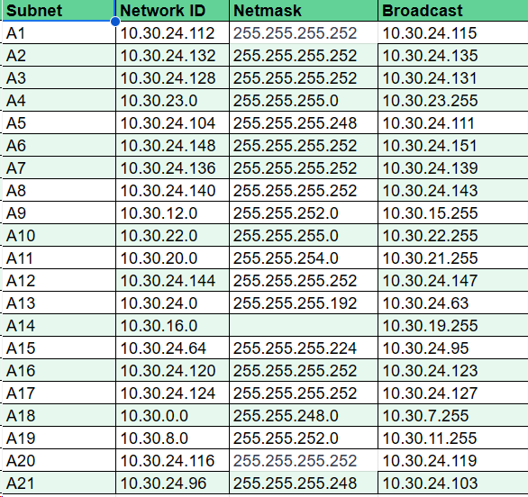
Untuk lebih jelas bisa diakses pada link [ini](https://docs.google.com/spreadsheets/d/1oaR5rntwo_eWIAiKplBfYfusrp2GwfaqX8wptFUeuYY/edit#gid=1463933795)
## ** _Tree_**
Berikut adalah tree yg didapat
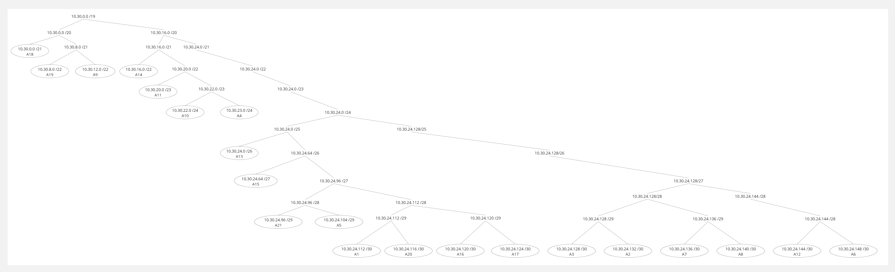

## **_Routing_**

Proses routing dapat dilakukan dengan mengkonfigurasi :
- _router_ - bagian Routing

Sebagai contoh kita akan proses routing dari aura ke subnet a18 yaitu hubungin dari aura ke host ApetitRegion dalam prosesnya itu kan dari aura kita bakal lewat banyak router. Anggep aja gini sebelum mau ke a18 kita juga bakal lewat a16 a17 nah kita set semua di Aura
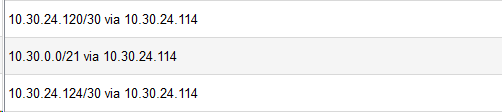
Namun proses itu belum selesai kita juga perlu set a17 a18 di  frieren
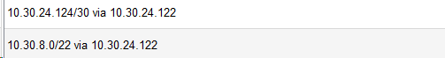
Dan berlaku juga set 18 di flamme
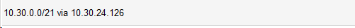
Untuk menentukan next-hop, next-hop sendiri adalah bagian yg terhubung secara langsung misal pada aura ada di Fa0/0
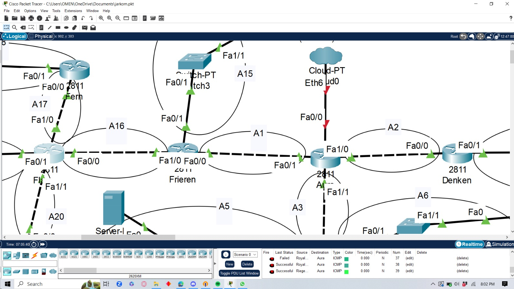
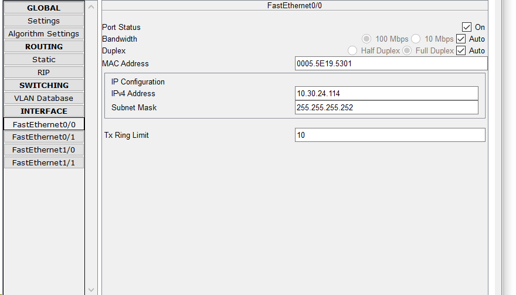
nah untuk yg 0.0.0.0 itu teori dibalik jadi di fern kita is 0.0.0.0 ke address flamme
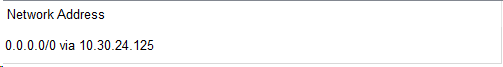
di flamme 0.0.0.0 ke address frieren
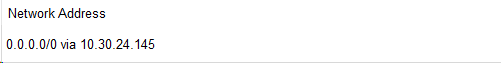
dan di frieren kita isi 0.0.0.0 ke adress aura
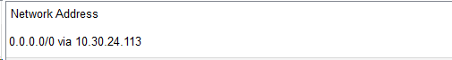
kalau misal mau ke a21 tinggal nambah config a21 dan a20 pada masing masing router kecuali a20 Flamme karena udh kehubung dan jangan lupa 0.0.0.0 ke di himmel ke arah flamme. Cara routing itu berlaku untuk semua.
