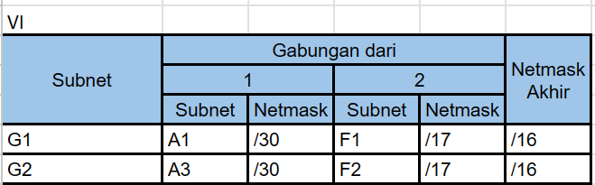
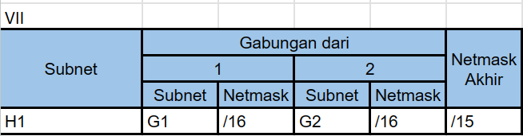

# Jarkom-Modul-4-D17-2023

**Praktikum Jaringan Komputer Modul 4 Tahun 2023**

# Author
| Nama | NRP |Github |
|---------------------------|------------|--------|
|Adam Haidar Azizi | 5025211114 | https://github.com/HADAIZI |
|Ahda Filza Ghaffaru | 5025211144 | https://github.com/Ahdaaa |

# **Dokumentasi dan Penjelasan Soal**
<div align=justify>

Berikut adalah dokumentasi yang berisi source code dari tiap soal dan penjelasan terkait perintah atau _syntax_ yang digunakan. 

## **Soal Praktikum 4**


- Soal shift dikerjakan pada Cisco Packet Tracer dan GNS3 menggunakan metode perhitungan CLASSLESS yang berbeda.
Keterangan: Bila di CPT menggunakan VLSM, maka di GNS3 menggunakan CIDR atau sebaliknya

- Jika tidak ada pemberitahuan revisi soal dari asisten, berarti semua soal BERSIFAT BENAR dan DAPAT DIKERJAKAN.

- Untuk di GNS3 CLOUD merupakan NAT1 jangan sampai salah agar bisa terkoneksi internet.

- Pembagian IP menggunakan Prefix IP yang telah ditentukan pada modul pengenalan.

- Pembagian IP dan routing harus SE-EFISIEN MUNGKIN.
Gambar topologi yang lebih jelas dapat diakses pada link [berikut](https://drive.google.com/file/d/1VmJXOyEoWru1tfXISOgoJiPfE1hpbptM/view)

### **Rute**
- Berikut adalah rute subnet dari topologi kami


# **VLSM**
Berikut adalah langkah-langkah pengerjaan untuk metode VLSM pada Ciscoo.
## **_Subnetting_**
Subnetting adalah proses membagi suatu jaringan IP menjadi bagian-bagian yang lebih kecil yang disebut subnet. Tujuan utama subnetting adalah untuk meningkatkan efisiensi penggunaan alamat IP dan mengelola lalu lintas jaringan dengan lebih efektif. Dengan menggunakan subnetting, administrator jaringan dapat mengoptimalkan alokasi alamat IP dan mengatur pengaturan keamanan atau kebijakan jaringan dengan lebih fleksibel. Subnetting memungkinkan sebuah jaringan besar dibagi menjadi beberapa bagian kecil yang lebih mudah dikelola, sehingga mempermudah administrasi dan meningkatkan keamanan.

berikut adalah hasil dari subnetting kami

Untuk lebih jelas bisa diakses pada link [ini](https://docs.google.com/spreadsheets/d/1oaR5rntwo_eWIAiKplBfYfusrp2GwfaqX8wptFUeuYY/edit#gid=1463933795)
## ** _Tree_**
Berikut adalah tree yg didapat


## **_Routing_**

Proses routing dapat dilakukan dengan mengkonfigurasi :
- _router_ - bagian Routing

- Sebagai contoh kita akan proses routing dari aura ke subnet a18 yaitu hubungin dari aura ke host ApetitRegion dalam prosesnya itu kan dari aura kita bakal lewat banyak router. Anggep aja gini sebelum mau ke a18 kita juga bakal lewat a16 a17 nah kita set semua di Aura


- Namun proses itu belum selesai kita juga perlu set a17 a18 di  frieren


- Dan berlaku juga set 18 di flamme


- Untuk menentukan next-hop, next-hop sendiri adalah bagian yg terhubung secara langsung misal pada aura ada di Fa0/0


- nah untuk yg 0.0.0.0 itu teori dibalik jadi di fern kita is 0.0.0.0 ke address flamme


- di flamme 0.0.0.0 ke address frieren


- dan di frieren kita isi 0.0.0.0 ke adress aura


- Kalau misal mau ke a21 tinggal nambah config a21 dan a20 pada masing masing router kecuali a20 Flamme karena udh kehubung dan jangan lupa 0.0.0.0 ke di himmel ke arah flamme. Cara routing itu berlaku untuk semua.

## Penjelasan CIDR-GNS

Teknik Subnetting CIDR (Classless Inter-Domain Routing) adalah pendekatan fleksibel dalam pembagian alamat IP tanpa terpaku pada batasan kelas tradisional (Class A, B, atau C). CIDR memungkinkan penggunaan subnet mask dengan panjang yang bervariasi, disesuaikan dengan kebutuhan spesifik jaringan.

CIDR memungkinkan efisiensi penggunaan alamat IP dan mengatasi pemborosan alamat IP pada subnetting kelas tradisional. Ini sangat berguna dalam alokasi alamat IP pada jaringan yang memerlukan jumlah host yang berbeda-beda di setiap subnetnya.

### Topologi GNS


### Penggabungan Subnet

Berdasarkan pengelompokan subnet A dari gambar topologi sebelumnya, kita akan melakukan penggabungan dari subnet-subnet tersebut dengan tujuan mendapatkan pembagian IP untuk masing-masing subnet.

#### Penggabungan Pertama


#### Penggabungan Kedua


#### Penggabungan Ketiga


#### Penggabungan Keempat


#### Penggabungan Kelima


#### Penggabungan Keenam


#### Penggabungan Ketujuh


#### Penggabungan Kedelapan


### Pembuatan Tree

Berdasarkan pembagian subnet sebelumnya, kita dapat membuat sebuah tree yang nantinya dapat digunakan untuk membuat tambel pembagian IP. Berikut adalah tree yang didapatkan,


### Pembagian IP

Dari Tree tersebut, kita mendapatkan sebuah tabel pembagian IP sebagaimana berikut,


### Network Configuration Topologi

Karena kita sudah memiliki tree pembagian IP, kita bisa masuk ke masing-masing node topologi untuk mengatur konfigurasi network-nya,

* Aura

```
auto eth0
iface eth0 inet dhcp
up iptables -t nat -A POSTROUTING -o eth0 -j MASQUERADE -s 10.30.0.0/14

auto eth1
iface eth1 inet static
	address 10.32.0.1
	netmask 255.255.255.252

auto eth2
iface eth2 inet static
	address 10.31.0.1
	netmask 255.255.255.252

auto eth3
iface eth3 inet static
	address 10.30.0.1
	netmask 255.255.255.252

```

* Frieren

```
auto eth0
iface eth0 inet static
	address 10.30.0.2
	netmask 255.255.255.252
	gateway 10.30.0.1
	up echo nameserver 192.168.122.1 > /etc/resolv.conf

auto eth1
iface eth1 inet static
	address 10.30.128.1
	netmask 255.255.255.224

auto eth2
iface eth2 inet static
	address 10.30.192.1
	netmask 255.255.255.252
```

* LakeKorridor

```
auto eth0
iface eth0 inet static
	address 10.30.128.2
	netmask 255.255.255.224
	gateway 10.30.128.1
	up echo nameserver 192.168.122.1 > /etc/resolv.conf
```

* Flamme

```
auto eth0
iface eth0 inet static
	address 10.30.192.2
	netmask 255.255.255.252
	gateway 10.30.192.1
	up echo nameserver 192.168.122.1 > /etc/resolv.conf

auto eth1a
iface eth1 inet static
	address 10.30.224.1
	netmask 255.255.255.252

auto eth2
iface eth2 inet static
	address 10.30.240.1
	netmask 255.255.252.0

auto eth3
iface eth3 inet static
	address 10.30.248.1
	netmask 255.255.255.252
```

* Fern

```
auto eth0
iface eth0 inet static
	address 10.30.224.2
	netmask 255.255.255.252
	gateway 10.30.224.1
	up echo nameserver 192.168.122.1 > /etc/resolv.conf

auto eth1
iface eth1 inet static
	address 10.30.232.1
	netmask 255.255.248.0
```

* AppetitRegion

```
auto eth0
iface eth0 inet static
	address 10.30.232.2
	netmask 255.255.248.0
	gateway 10.30.232.1
	up echo nameserver 192.168.122.1 > /etc/resolv.conf
```

* LaubHills

```
auto eth0
iface eth0 inet static
	address 10.30.232.3
	netmask 255.255.248.0
	gateway 10.30.232.1
	up echo nameserver 192.168.122.1 > /etc/resolv.conf
```

* RohrRoad

```
auto eth0
iface eth0 inet static
	address 10.30.240.2
	netmask 255.255.252.0
	gateway 10.30.240.1
	up echo nameserver 192.168.122.1 > /etc/resolv.conf
```

* Himmel

```
auto eth0
iface eth0 inet static
	address 10.30.248.2
	netmask 255.255.255.252
	gateway 10.30.248.1
	up echo nameserver 192.168.122.1 > /etc/resolv.conf

auto eth1
iface eth1 inet static
	address 10.30.252.1
	netmask 255.255.255.248

```

* SchwerMountains

```
auto eth0
iface eth0 inet static
	address 10.30.252.2
	netmask 255.255.255.248
	gateway 10.30.252.1
	up echo nameserver 192.168.122.1 > /etc/resolv.conf
```

* Denken

```
auto eth0
iface eth0 inet static
	address 10.32.0.2
	netmask 255.255.255.252
	gateway 10.32.0.1
	up echo nameserver 192.168.122.1 > /etc/resolv.conf

auto eth1
iface eth1 inet static
	address 10.30.33.1
	netmask 255.255.255.0
```

* RoyalCapital

```
auto eth0
iface eth0 inet static
	address 10.30.33.2
	netmask 255.255.255.0
	gateway 10.30.33.1
	up echo nameserver 192.168.122.1 > /etc/resolv.conf

```

* WilleRegion

```
auto eth0
iface eth0 inet static
	address 10.30.33.3
	netmask 255.255.255.0
	gateway 10.30.33.1
	up echo nameserver 192.168.122.1 > /etc/resolv.conf
```

* Eisen

```
auto eth0
iface eth0 inet static
	address 10.31.0.2
	netmask 255.255.255.252
	gateway 10.31.0.1
	up echo nameserver 192.168.122.1 > /etc/resolv.conf

auto eth1
iface eth1 inet static
	address 10.31.144.1
	netmask 255.255.255.252

auto eth2
iface eth2 inet static
	address 10.31.192.1
	netmask 255.255.255.252

auto eth3
iface eth3 inet static
	address 10.31.128.1
	netmask 255.255.255.248

auto eth4
iface eth4 inet static
	address 10.31.160.1
	netmask 255.255.255.252
```

* Richter

```
auto eth0
iface eth0 inet static
	address 10.31.128.2
	netmask 255.255.255.248
	gateway 10.31.128.1
	up echo nameserver 192.168.122.1 > /etc/resolv.conf
```

* Revolte

```
auto eth0
iface eth0 inet static
	address 10.31.128.3
	netmask 255.255.255.248
	gateway 10.31.128.1
	up echo nameserver 192.168.122.1 > /etc/resolv.conf
```

* Stark

```
auto eth0
iface eth0 inet static
	address 10.31.144.2
	netmask 255.255.255.252
	gateway 10.31.144.1
	up echo nameserver 192.168.122.1 > /etc/resolv.conf
```
* TurkRegion

```
auto eth0
iface eth0 inet static
	address 10.31.176.2
	netmask 255.255.252.0
	gateway 10.31.176.1
	up echo nameserver 192.168.122.1 > /etc/resolv.conf

```
* GrobeForest

```
auto eth0
iface eth0 inet static
	address 10.31.184.2
	netmask 255.255.255.0
	gateway 10.31.184.1
	up echo nameserver 192.168.122.1 > /etc/resolv.conf
```

* Linie 

```
auto eth0
iface eth0 inet static
	address 10.31.192.2
	netmask 255.255.255.252
	gateway 10.31.192.1
	up echo nameserver 192.168.122.1 > /etc/resolv.conf

auto eth1
iface eth1 inet static
	address 10.31.224.1
	netmask 255.255.254.0

auto eth2
iface eth2 inet static
	address 10.31.240.1
	netmask 255.255.255.252

```

* GranzChannel

```
auto eth0
iface eth0 inet static
	address 10.31.224.2
	netmask 255.255.254.0
	gateway 10.31.224.1
	up echo nameserver 192.168.122.1 > /etc/resolv.conf
```

* Lawine

```
auto eth0
iface eth0 inet static
	address 10.31.240.2
	netmask 255.255.255.252
	gateway 10.31.240.1
	up echo nameserver 192.168.122.1 > /etc/resolv.conf

auto eth1
iface eth1 inet static
	address 10.31.248.1
	netmask 255.255.255.192

```

* BredtRegion

```
auto eth0
iface eth0 inet static
	address 10.31.248.2
	netmask 255.255.255.192
	gateway 10.31.248.1
	up echo nameserver 192.168.122.1 > /etc/resolv.conf

```

* Heiter

```
auto eth0
iface eth0 inet static
	address 10.31.248.3
	netmask 255.255.255.192
	gateway 10.31.248.1
	up echo nameserver 192.168.122.1 > /etc/resolv.conf

auto eth1
iface eth1 inet static
	address 10.31.252.1
	netmask 255.255.252.0
```

* Sein

```
auto eth0
iface eth0 inet static
	address 10.31.252.2
	netmask 255.255.252.0
	gateway 10.31.252.1
	up echo nameserver 192.168.122.1 > /etc/resolv.conf
```

* RiegelCanyon

```
auto eth0
iface eth0 inet static
	address 10.31.252.3
	netmask 255.255.252.0
	gateway 10.31.252.1
	up echo nameserver 192.168.122.1 > /etc/resolv.conf
```

### Proses Routing

Setelah mengatur konfigurasi network pada masing-masing node, lakukan routing pada tiap router agar bisa dilakukan testing.

* Aura

```
#Kanan
route add -net <nid> netmask <netmask> gw <ip>
route add -net 10.33.0.0 netmask 255.255.255.0 gw 10.32.0.2 : a4
#Kiri
route add -net 10.30.128.0 netmask 255.255.255.224 gw 10.30.0.2 : a15
route add -net 10.30.192.0 netmask 255.255.255.252 gw 10.30.0.2 : a16
route add -net 10.30.224.0 netmask 255.255.255.252 gw 10.30.0.2 : a17
route add -net 10.30.232.0 netmask 255.255.248.0 gw 10.30.0.2 : a18
route add -net 10.30.240.0 netmask 255.255.252.0 gw 10.30.0.2 : a19
route add -net 10.30.248.0 netmask 255.255.255.252 gw 10.30.0.2 : a20
route add -net 10.30.252.0 netmask 255.255.255.248 gw 10.30.0.2 : a21
#Bawah
route add -net 10.31.128.0 netmask 255.255.255.248 gw 10.31.0.2 : a5
route add -net 10.31.144.0 netmask 255.255.255.252 gw 10.31.0.2 : a6
route add -net 10.31.160.0 netmask 255.255.255.252 gw 10.31.0.2 : a7
route add -net 10.31.192.0 netmask 255.255.255.252 gw 10.31.0.2 : a8
route add -net 10.31.176.0 netmask 255.255.252.0 gw 10.31.0.2 : a9
route add -net 10.31.184.0 netmask 255.255.255.0 gw 10.31.0.2 : a10
route add -net 10.31.224.0 netmask 255.255.254.0 gw 10.31.0.2 : a11
route add -net 10.31.240.0 netmask 255.255.255.252 gw 10.31.0.2 : a12
route add -net 10.31.248.0 netmask 255.255.255.192 gw 10.31.0.2 : a13
route add -net 10.31.252.0 netmask 255.255.252.0 gw 10.31.0.2 
```

* Denken

```
route add -net 0.0.0.0 netmask 0.0.0.0 gw 10.32.0.1 
```

* Frieren

```
route add -net 10.30.224.0 netmask 255.255.255.252 gw 10.30.192.2
route add -net 10.30.232.0 netmask 255.255.248.0 gw 10.30.192.2 
route add -net 10.30.240.0 netmask 255.255.252.0 gw 10.30.192.2 
route add -net 10.30.248.0 netmask 255.255.255.252 gw 10.30.192.2 
route add -net 10.30.252.0 netmask 255.55.255.248 gw 10.30.192.2
```

* Flamme

```
route add -net 10.30.232.0 netmask 255.255.248.0 gw 10.30.224.2 
route add -net 10.30.252.0 netmask 255.255.255.248 gw 10.30.248.2
```

* Himmel

```
route add -net 0.0.0.0 netmask 0.0.0.0 gw 10.30.248.1
```

* Eisen

```
route add -net 10.31.176.0 netmask 255.255.252.0 gw 10.31.160.2
route add -net 10.31.184.0 netmask 255.255.255.0 gw 10.31.160.2
route add -net 10.31.224.0 netmask 255.255.254.0 gw 10.31.192.2
route add -net 10.31.240.0 netmask 255.255.255.252 gw 10.31.192.2
route add -net 10.31.248.0 netmask 255.255.255.192 gw 10.31.192.2
route add -net 10.31.252.0 netmask 255.255.252.0 gw 10.31.192.2
```

* Lugner
```
route add -net 0.0.0.0 netmask 0.0.0.0 gw 10.31.160.1
```

* Linie

```
route add -net 10.31.248.0 netmask 255.255.255.192 gw 10.31.240.2
route add -net 10.31.252.0 netmask 255.255.252.0 gw 10.31.240.2
```

* Lawine

```
route add -net 10.31.252.0 netmask 255.255.252.0 gw 10.31.248.3
```

* Heiter

```
route add -net 0.0.0.0 netmask 0.0.0.0 gw 10.31.248.1
```